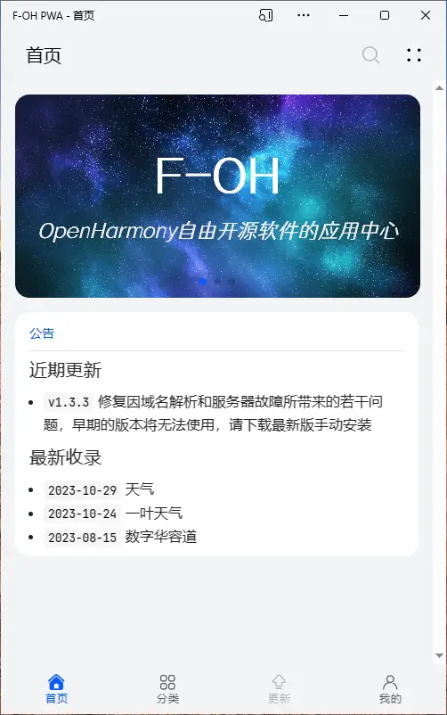
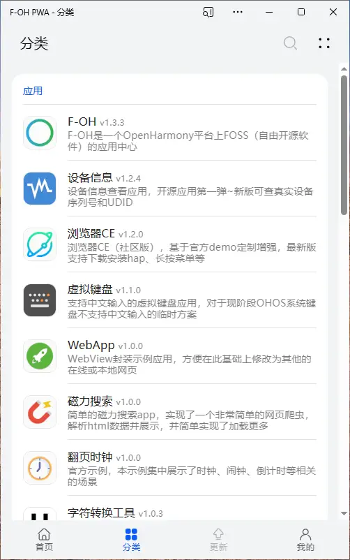
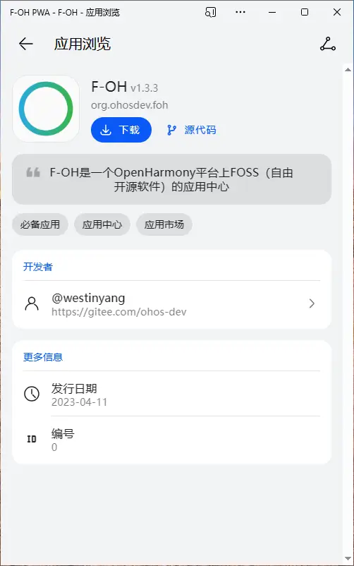
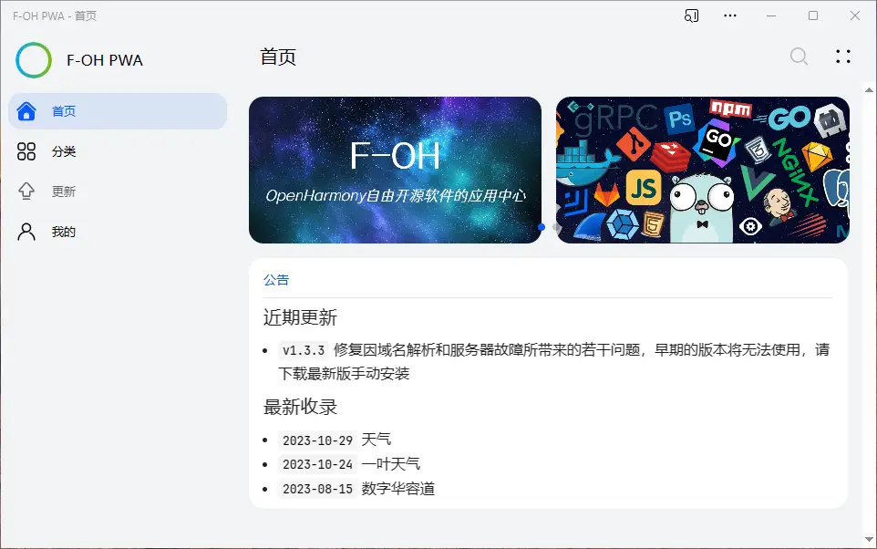
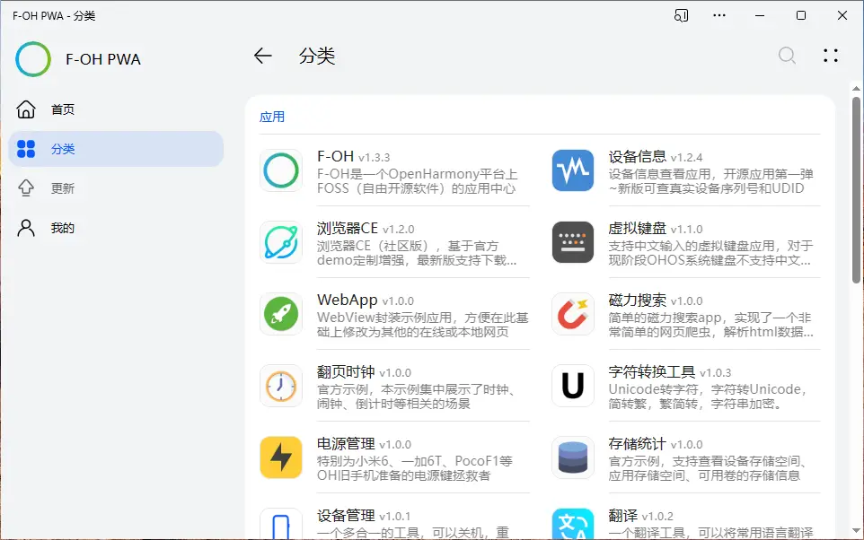
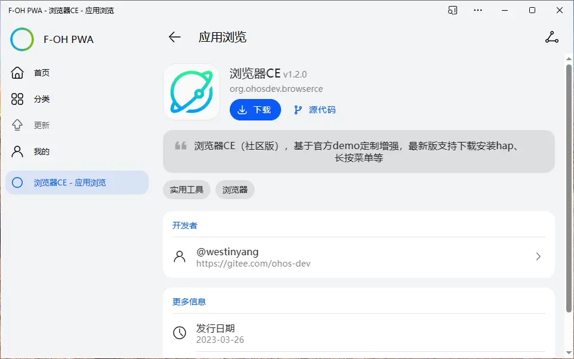
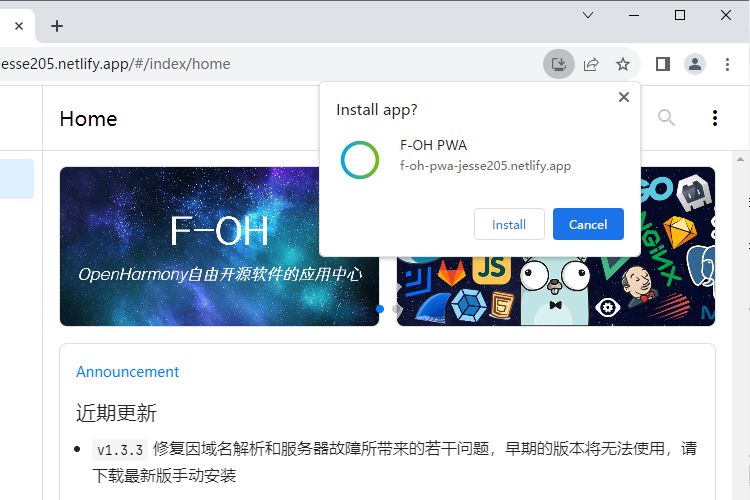

<div align="center">


# F-OH PWA 

[](https://gitee.com/Jesse205/F-OH-PWA)
[](https://github.com/Jesse205/F-OH-PWA)

[][Website]
[][ReleaseInGitee]
[][ReleaseInGitee]

[中文](./README.zh.md)
| **English**
| <small>More translations are welcome!</small>

</div>


F-OH is an application center for FOSS (Free and Open Source Software) on the OpenHarmony platform with download and installation support.

F-OH PWA is a cross-platform **third-party** F-OH based on a browser version of the [Sparkling Store V3 Demo](https://gitee.com/sparkling-store/SparklingStoreV3Demo).

F-OH PWA + BrowserCE, best practices for distributing OpenHarmony hap apps via web pages, might be a good choice for teams with internal distribution of test hap apps.

[](./LICENSE)
[](https://app.netlify.com/sites/f-oh-pwa-jesse205/deploys)

[](https://qm.qq.com/q/jWeBdnvPz2)
[](https://qm.qq.com/q/jWeBdnvPz2)

## Screenshots

<div>



</div>
<div>



</div>

## Download or Launch

The F-OH PWA offers a choice between **standalone software** and **web access**.

- **F-OH Tauri** : ~~Deep system integration, near-native experience~~, no automatic updates, available offline, fast loading.
  - [Gitee Releases](https://gitee.com/ohos-dev/F-OH-PWA/releases/latest)
- **F-OH Lite**、**F-OH PWA** : Click-and-go, automatic update, no download required.
  - Release: <http://74.48.94.162:5000/>
  - Development: <https://f-oh-pwa-jesse205.netlify.app/>

> [!TIP]\
> ~~F-OH PWA is temporarily unavailable because the server does not have SSL and has cross-domain issues ([No security context to meet the minimum requirements to be a PWA][PWASecureContextRequirement]), please use F-OH Tauri or F-OH Lite (Web).~~ If you want to use use the PWA, use the development version deployed on Netlify.

> [!NOTE]\
> This PWA application will not be able to enter the new page after update, some functions may be abnormal, please refresh before use it.

### PWA Installation

A **progressive web app** (PWA) is an app that's built using web platform technologies, but that provides a user experience like that of a platform-specific app. (From [MDN](https://developer.mozilla.org/zh-CN/docs/Web/Progressive_web_apps))

Some browsers support installing this website to the desktop by clicking "Install Application". After installation, the application name will change from `F-OH Lite` to `F-OH PWA`.



> [!TIP]\
> For more information about using PWAs, see [Use Progressive Web Apps in Microsoft Edge](https://learn.microsoft.com/en-us/microsoft-edge/progressive-web-apps-chromium/ux).

## Series of Projects

- [F-OH](https://gitee.com/westinyang/f-oh): F-OH OpenHarmony Mobile
- [F-OH Data][F-OH-Data]: metadata for all F-OH apps, where developers PR submit their apps
- F-OH Server: F-OH server, providing interface services, platform management, etc. (to be developed)
- F-OH Website: F-OH website, including documents, blogs, selected applications, etc. (to be developed)

## Project Setup

1. Install NodeJS v19
2. Install Yarn
3. Set up the Tauri environment according to [Tauri prep](https://tauri.app/v1/guides/getting-started/prerequisites/).
   - Windows: Microsoft Visual Studio C++ Builder, WebView2, Rust.
   - macOS: CLang and macOS development dependencies, Rust.
   - Linux: system dependencies, Rust.
4. Run `yarn install`

### Compiling and Hotloading for Development

1. Clone [F-OH Data][F-OH-Data] and start a server on port `5500`.
2. Save [ `.env.development.local.example`](. /.env.development.local.example) as `.env.development.local` and configure some variables.
3. Open a terminal in the project and run commands according to the following rules.
   - Web and PWA applications: run `yarn dev`.
   - Windows Tauri software: run `yarn dev:tauri`.

### Compiling and Streamlining for Production

1. Set up the `.env.production` file.
2. Follow the example in [`.env.development.local.example`](. /.env.development.local.example) to configure the data server as shown in the example.
3. Open a terminal in the project and run commands according to the following rules.
   - Web pages and PWA applications:
     1. Run `yarn build`.
     2. Pull [F-OH Data][F-OH-Data] into `dist/data`.
     3. Deploy `dist/*` to the server.
   - Windows Tauri software:
     1. Run `yarn build:tauri`.
     2. Release `src-tauri\target\release\F-OH Tauri.exe` and `src-tauri\target\release\bundle\nsis\F-OH Tauri_<version>_x64-setup.exe`.

## Lint and Fixing Files

```bash
yarn eslint:fix
yarn prettier:fix
```

## Support Program

Sponsorship can be contacted by private message or scanning the QR code below (WeChat, Alipay)

> [!NOTE]\
> Please note "F-OH" or private message to [@westinyang (Gitee)][@westinyang] for sponsorship fee, so that it can be counted in [Sponsor List][SponsorList].


For this project (F-OH PWA), you can go to the [Hello Tool donation page](https://jesse205.github.io/hellotool/donation.html) to support Jesse205.

## Contributing

Please read [`CONTRIBUTING.zh.md`](./CONTRIBUTING.md).

## License

```txt
Copyright (C) 2023 Jesse205

This program is free software: you can redistribute it and/or modify
it under the terms of the GNU General Public License as published by
the Free Software Foundation, either version 3 of the License, or
(at your option) any later version.

This program is distributed in the hope that it will be useful,
but WITHOUT ANY WARRANTY; without even the implied warranty of
MERCHANTABILITY or FITNESS FOR A PARTICULAR PURPOSE.  See the
GNU General Public License for more details.

You should have received a copy of the GNU General Public License
along with this program.  If not, see <https://www.gnu.org/licenses/>.
```

[F-OH-Data]: http://74.48.94.162:3000/ohos-dev/F-OH-Data
[PWASecureContextRequirement]: https://developer.mozilla.org/en-US/docs/Web/Progressive_web_apps/Guides/Making_PWAs_installable#secure_context
[SponsorList]: https://gitee.com/ohos-dev/f-oh#%E8%B5%9E%E5%8A%A9%E5%88%97%E8%A1%A8
[@westinyang]: https://gitee.com/westinyang
[ReleaseInGitee]: https://gitee.com/ohos-dev/F-OH-PWA/releases/latest
[Website]: https://f-oh-pwa-jesse205.netlify.app/
