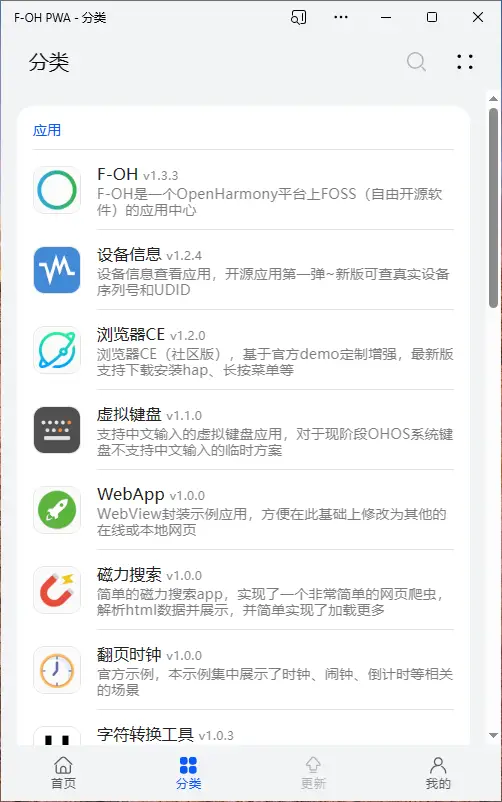
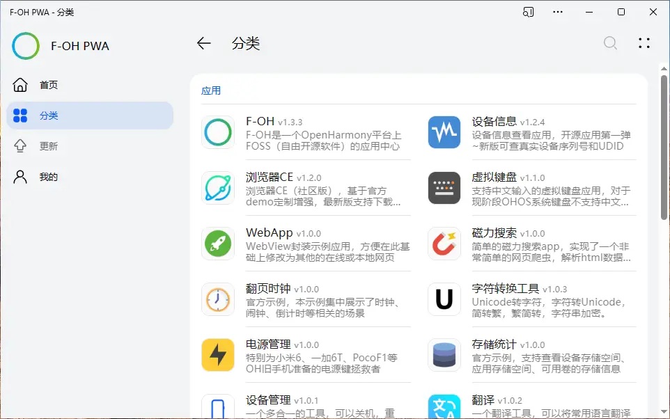
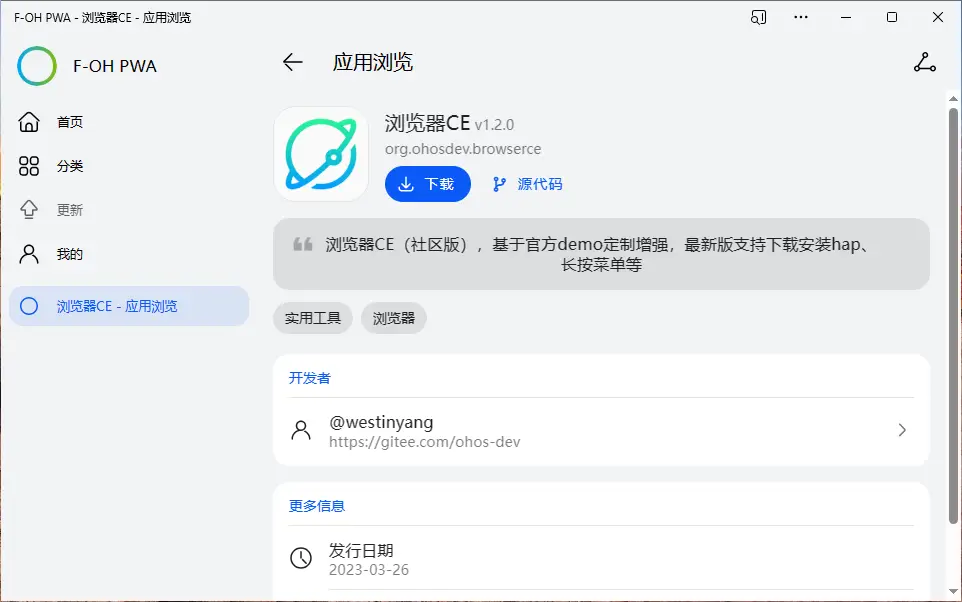

<div align="center">


# F-OH PWA 

[](https://gitee.com/Jesse205/F-OH-PWA)
[](https://github.com/Jesse205/F-OH-PWA)

[][Website]
[][ReleaseInGitee]
[][ReleaseInGitee]

**中文** |
[English](./README.md) |
<small>期待你的翻译！</small>

</div>


[F-OH] 是一个 OpenHarmony 平台上 FOSS（Free and Open Source Software，自由开源软件）的应用中心，并提供下载安装支持。

F-OH PWA 是基于[粼光商店 V3 Demo](https://gitee.com/sparkling-store/SparklingStoreV3Demo) 的一个浏览器版本的跨平台的**第三方** [F-OH]。

F-OH PWA + BrowserCE，通过网页分发开源鸿蒙 hap 应用的最佳实践，对于有内部分发测试 hap 应用的团队来说，是一个不错的选择。

> 2023-12-29 [F-OH 停服公告](https://gitee.com/westinyang/f-oh/blob/master/ServerStopAnnouncement.md)

[](./LICENSE)
[](https://app.netlify.com/sites/f-oh-pwa-jesse205/deploys)
[](./CODE_OF_CONDUCT.zh.md)

[](./docs/terms/licenses_v1.0.0.md)

[](https://qm.qq.com/q/jWeBdnvPz2)
[](https://qm.qq.com/q/jWeBdnvPz2)

## 屏幕截图

<div>



</div>
<div>



</div>

## 特点

- 设计：[HarmonyOS Design](https://developer.harmonyos.com/cn/design/)
- 平台：浏览器、Linux、Windows
- 广告：无
- 资费：暂时没有
- 源代码：开源到 Gitee、GitHub
- 国际化：基于 Vue I18n 的多语言

## 下载与访问

F-OH PWA 提供 **独立软件** 与 **网页访问** 两种方式供用户选择。

- **F-OH Tauri** ：~~系统深度集成，近乎原生的体验~~，不会自动更新，离线可用，加载快速。
  - [Gitee 发行版][ReleaseInGitee]
- **F-OH Lite**、**F-OH PWA**  ：点击即用，自动更新，无需下载。
  - 正式版：<http://74.48.94.162:5000/>
  - 开发版：<https://f-oh-pwa-jesse205.netlify.app/>

> [!TIP]\
> ~~因服务器没有 SSL 并且有跨域问题， F-OH PWA 暂时无法使用（[无安全上下文，无法满足成为 PWA 的最低要求][PWASecureContextRequirement]），请使用 F-OH Tauri 或 F-OH Lite (Web)。~~ 如需使用 PWA，请使用部署在 Netlify 上的开发版。

> [!NOTE]\
> 此 PWA 应用在更新后会无法进入新页面，部分功能可能异常，请刷新后使用。

### PWA 安装

**渐进式 Web 应用**（Progressive Web App，PWA）是一个使用 web 平台技术构建的应用程序，但它提供的用户体验就像一个特定平台的应用程序。（来自 [MDN](https://developer.mozilla.org/zh-CN/docs/Web/Progressive_web_apps)）

部分浏览器支持安装该网站到桌面，只需点击“安装应用”。安装后应用名会由 `F-OH Lite` 变为 `F-OH PWA`。


> [!NOTE]\
> 有关使用 PWA 的更多信息，请参见[在 Microsoft Edge 中使用渐进式 Web 应用](https://learn.microsoft.com/zh-cn/microsoft-edge/progressive-web-apps-chromium/ux)。

## 系列项目

- [F-OH]：F-OH OpenHarmony 移动端
- [F-OH Data]：F-OH 所有应用程序的元数据，开发者在这里PR提交自己的应用
- [F-OH Server]：F-OH 服务器，提供接口服务、平台管理等（待开发）
- [F-OH Website]：F-OH 网站，包含文档、博客、精选应用等（待开发）

## 项目设置

1. 安装 NodeJS v19
2. 安装 Yarn
3. 按照 [Tauri 的预先准备](https://tauri.app/zh-cn/v1/guides/getting-started/prerequisites)设置 Tauri 环境。
   - Windows: Microsoft Visual Studio C++ 生成工具、WebView2、Rust。
   - macOS: CLang 和 macOS 开发依赖项、Rust。
   - Linux: 系统依赖、Rust。
4. 运行 `yarn install`

### 为开发编译和热加载

1. 克隆 [F-OH Data] 并启动一个服务器。
2. 将 [`.env.development.local.example`](./.env.development.local.example) 另存为 `.env.development.local`，并配置一些变量。
3. 在该项目打开终端，按照以下规则运行命令。
   - 网页与 PWA 应用：运行 `yarn dev` 。
   - Windows Tauri 软件：运行 `yarn dev:tauri` 。

### 为生产编译和精简

1. 设置 `.env.production` 文件。
2. 在该项目打开终端，按照以下规则运行命令。
   - 网页与 PWA 应用：
     1. 运行 `yarn build` 。
     2. 拉取 [F-OH Data] 到 `dist/data` 。
     3. 部署 `dist/*` 到服务器。
   - Windows Tauri 软件：
     1. 运行 `yarn build:tauri` 。
     2. 发布 `src-tauri\target\release\F-OH Tauri.exe` 与 `src-tauri\target\release\bundle\nsis\F-OH Tauri_<version>_x64-setup.exe`

### 约束和修复文件

```bash
yarn eslint:fix
yarn prettier:fix
```

## 贡献项目

请阅读 [`CONTRIBUTING.zh.md`](./CONTRIBUTING.zh.md)。

## 支持项目

赞助可私信联系[@westinyang]或扫描下方二维码（微信、支付宝）

> [!TIP]\
> 赞助费用请备注“F-OH”或私信告诉[@westinyang]，方便统计到[赞助列表][SponsorList]中。


对于本项目（F-OH PWA），您可以进入[哈兔 Box 捐赠页面](https://jesse205.github.io/hellotool/donation.html)支持杰西 205。

## 许可证

```txt
Copyright (C) 2023 Jesse205

This program is free software: you can redistribute it and/or modify
it under the terms of the GNU General Public License as published by
the Free Software Foundation, either version 3 of the License, or
(at your option) any later version.

This program is distributed in the hope that it will be useful,
but WITHOUT ANY WARRANTY; without even the implied warranty of
MERCHANTABILITY or FITNESS FOR A PARTICULAR PURPOSE.  See the
GNU General Public License for more details.

You should have received a copy of the GNU General Public License
along with this program.  If not, see <https://www.gnu.org/licenses/>.
```

[F-OH]: https://gitee.com/westinyang/f-oh
[F-OH Server]: https://gitee.com/westinyang/f-oh/blob/master/F-OH-Server.md
[F-OH Website]: https://gitee.com/westinyang/f-oh/blob/master/F-OH-Web.md
[F-OH Data]: https://gitee.com/westinyang/f-oh-data
[PWASecureContextRequirement]: https://developer.mozilla.org/zh-CN/docs/Web/Progressive_web_apps/Guides/Making_PWAs_installable#%E5%AE%89%E5%85%A8%E4%B8%8A%E4%B8%8B%E6%96%87
[SponsorList]: https://gitee.com/ohos-dev/f-oh#%E8%B5%9E%E5%8A%A9%E5%88%97%E8%A1%A8
[@westinyang]: https://gitee.com/westinyang
[ReleaseInGitee]: https://gitee.com/ohos-dev/F-OH-PWA/releases/latest
[Website]: https://f-oh-pwa-jesse205.netlify.app/
